<div align="center">


<h1>Azure OpenAI Terraform</h1>

<p><strong>Industrialized Infrastructure-as-Code for Secure, Governed & Scalable Generative AI Ecosystems</strong></p>

[](https://devopstrio.co.uk/)
[](https://devopstrio.co.uk/)
[](https://devopstrio.co.uk/)
[](/apps/terraform-engine)

</div>

---

## 🏛️ Executive Summary

The **Azure OpenAI Terraform** platform is a flagship enterprise solution designed to industrialize the deployment and management of Generative AI infrastructure on Microsoft Azure. As organizations transition from AI experimentation to production-scale operations, the complexity of managing private networking, cross-region availability, and resource quotas becomes a significant bottleneck. This platform codifies "AI-Infrastructure-as-a-Service," providing a library of hardened, security-validated Terraform modules that automate the creation of complete GenAI environments in minutes.

By integrating a sophisticated **Terraform Orchestration Engine** with automated **Governance, Security, and Cost Engines**, the platform ensures that every AI workload is deployed within a Zero-Trust perimeter. It provides a boardroom-ready Command Center that gives executives real-time visibility into infrastructure drift, environment promotion status, and global AI spend, transforming Infrastructure-as-Code from a technical tool into a strategic business asset for the AI era.

### Strategic Business Outcomes
- **Accelerated Deployment Velocity**: Reduce environment provisioning time from weeks to minutes through automated, standardized, and reusable Terraform blueprints.
- **Zero-Trust AI Foundations**: Enforce network isolation, private endpoints, and encryption at rest through codified security guardrails that are non-negotiable by design.
- **Standardized Governance-as-Code**: Eliminate manual compliance audits by embedding naming conversions, tagging mandates, and region restrictions directly into the IaC pipeline.
- **Optimized Financial Transparency**: Gain granular visibility into AI infrastructure costs with automated budget alerts and chargeback reporting across multi-region deployments.

---

## 🏗️ Technical Architecture Details

### 1. High-Level IaC Platform Architecture
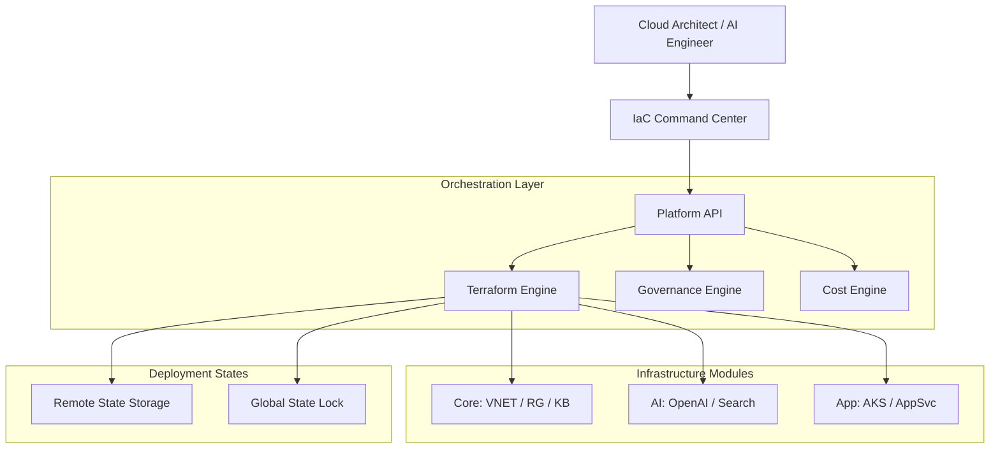

### 2. Terraform Apply Workflow
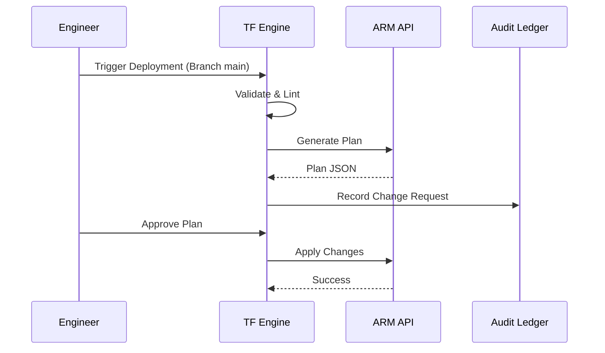

### 3. Module Dependency Graph
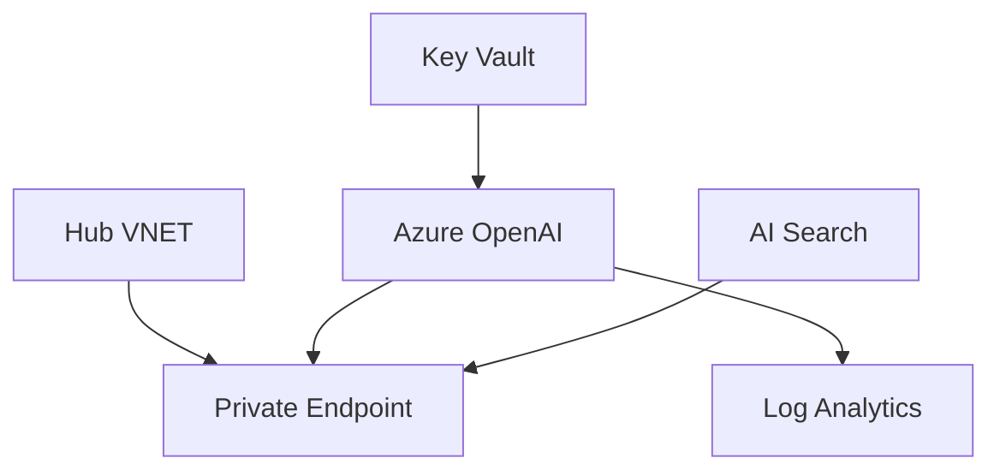

### 4. Private Endpoint Lifecycle
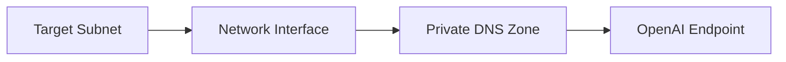

### 5. RAG Platform Topology
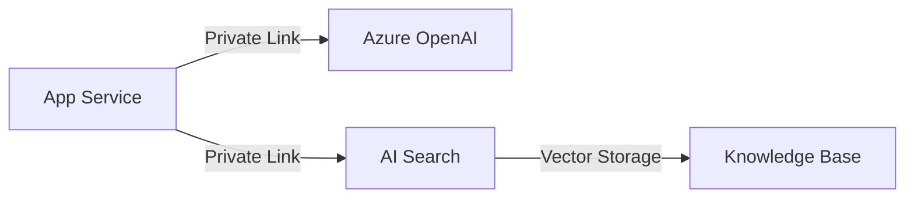

### 6. Security Trust Boundary
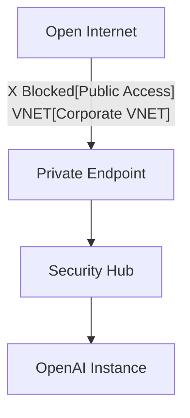

### 7. Azure Global Topology
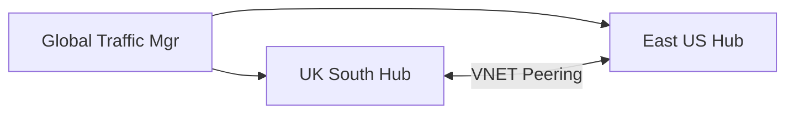

### 8. API Request Lifecycle
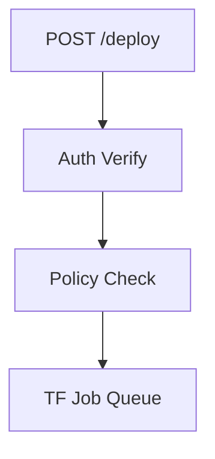

### 9. Multi-Tenant Tenancy Model
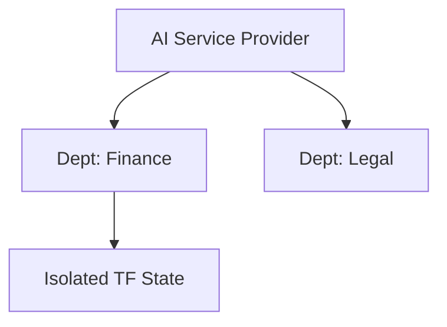

### 10. Monitoring & Telemetry Flow
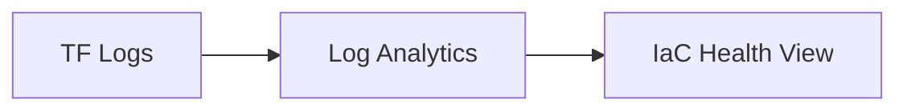

### 11. Disaster Recovery Topology
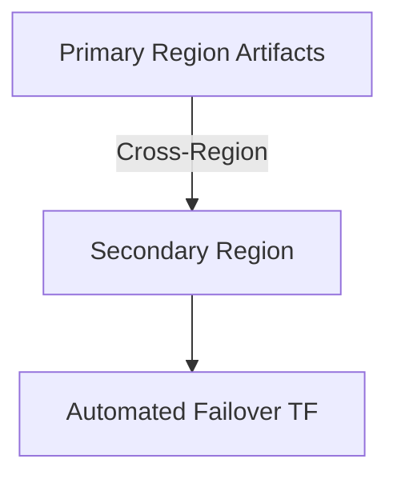

### 12. Identity Federation Model
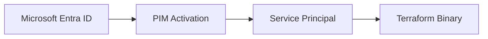

### 13. Cost Governance Workflow
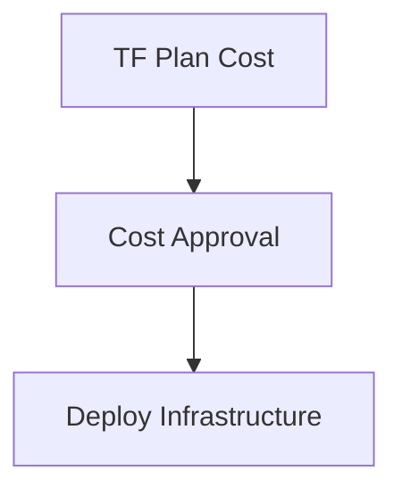

### 14. CI/CD Infrastructure Pipeline
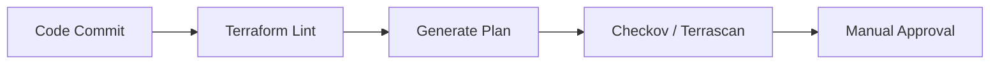

### 15. Executive Governance Workflow
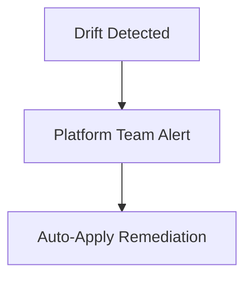

### 16. Global Region Topology
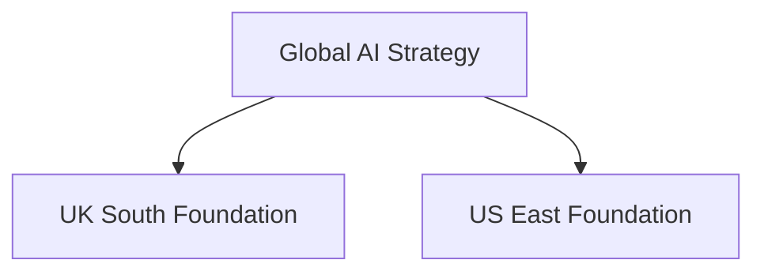

### 17. Drift Remediation Workflow
```mermaid
graph LR
    Current[Actual State] != Target[Desired State]
    Target --> Fix[Terraform Refresh]
    Fix --> Update[Consolidated State]
```

### 18. State Backend Workflow
```mermaid
graph LR
    Local[Local Changes] --> Push[Push to Backend]
    Push --> Storage[Azure Blob (Locked)]
```

### 19. Environment Promotion Flow
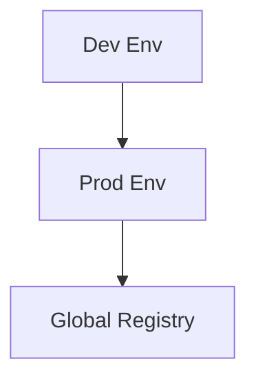

### 20. Chargeback Model
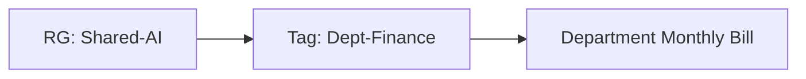

---

## 🚀 Deployment Guide

### Terraform Hub Rollout (Quickstart)
```bash
cd terraform/environments/prd
terraform init
terraform apply -auto-approve
```

---
<sub>&copy; 2026 Devopstrio &mdash; Engineering the Scalable Foundation for the Next-Generation AI Infrastructure.</sub>
