<div align="center">


<h1>Azure OpenAI Terraform</h1>

<p><strong>The Institutional-Grade Platform for Standardized GenAI Foundations, IaC Governance, and Multi-Cloud Intelligence Ecosystems.</strong></p>

[]()
[]()
[]()

<br/>

> **"Industrializing AI infrastructure to automate intelligence foundations."** 
> **Azure OpenAI Terraform** is an enterprise-grade platform designed to provide a secure, measurable, and highly automated foundation for global Generative AI operations. It orchestrates the complex lifecycle of AI infrastructure—from automated OpenAI provisioning and multi-cloud RAG reconciliation to high-throughput deployment intelligence and unified infrastructure auditing.

</div>

---

## 🏛️ Executive Summary

Fragmented AI perimeters and manual infrastructure orchestration are strategic operational liabilities; lack of a standardized AI infrastructure framework is a primary barrier to organizational engineering maturity. Organizations fail to scale their GenAI workloads not because of a lack of models, but because of fragmented evaluation standards, lack of automated networking reconciliation, and an inability to orchestrate infrastructure planes with operational precision.

This platform provides the **Infrastructure Intelligence Plane**. It implements a complete **Azure-OpenAI-Terraform-as-Code Framework**, enabling CTOs and AI Architects to manage global AI foundations as first-class citizens. By automating the identification of architectural regressions through real-time telemetry analysis and orchestrating the provisioning of secure performance-driven AI policies, we ensure that every organizational AI resource—from core model clusters to edge search indexes—is provisioned by default, audited for history, and strictly aligned with institutional AI frameworks.

---

## 📐 Architecture Storytelling: Principal Reference Models

### 1. Principal Architecture: Global AI Infrastructure & Intelligence Plane
This diagram illustrates the high-level relationship between the IaC Command Center, the Orchestration Layer, and the underlying infrastructure modules. It defines the bridge between AI Engineers and the cloud substrate.

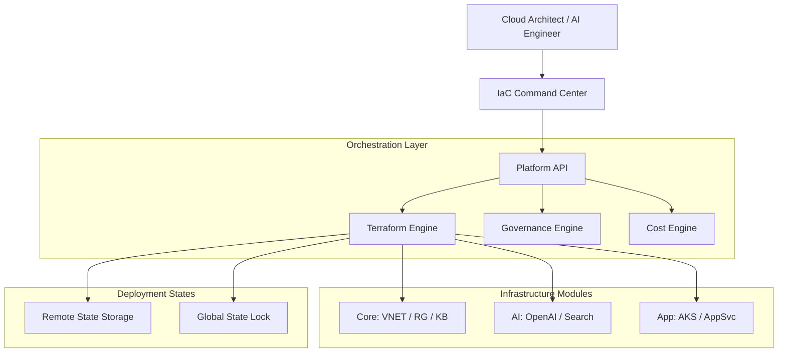

### 2. The AI Lifecycle Flow (Terraform Apply Workflow)
The continuous path of an AI infrastructure platform from initial validation and linting to active plan generation, approval, and ARM-level execution. This ensures zero-interruption operations through dependency-aware deployment.

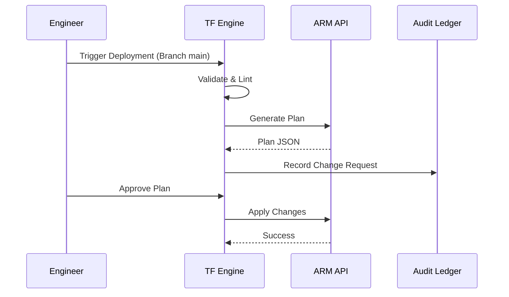

### 3. Distributed AI Topology (Module Dependency & RAG Patterns)
Strategically orchestrating standardized AI resources across global regions and diverse resource architectures (VNET, Private Endpoints, AI Search), providing a unified institutional view of RAG readiness.

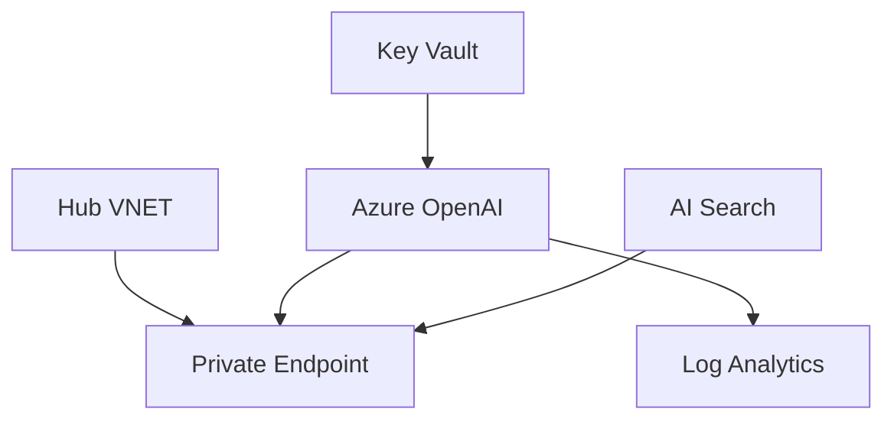

**RAG Platform Topology:**
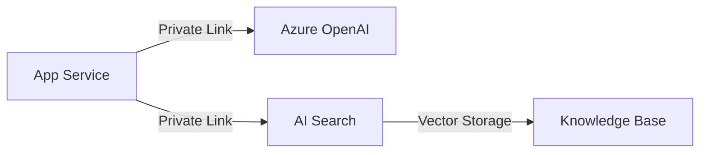

### 4. Governance Hub & Cost Control Flow
Executing complex logic for securing the bridge between infrastructure owners and technical teams, ensuring every API request is authorized, costs are approved, and executive oversight is maintained.

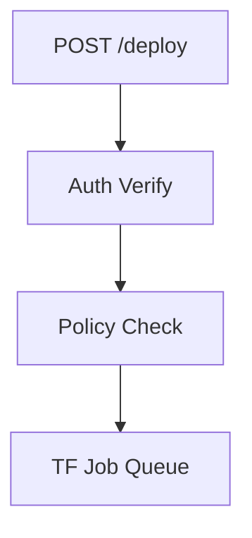

**Cost Governance Workflow:**
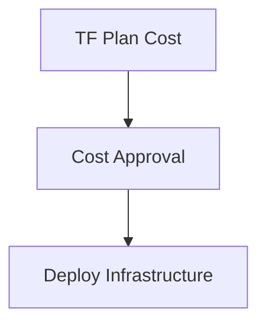

**Chargeback Model:**
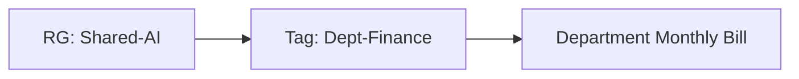

### 5. Multi-Cloud AI Federation & Global Topology
Automatically managing unified AI standards across global regions (UK South, US East) and diverse cloud tenants, ensuring institutional data residency and privacy boundaries by default.

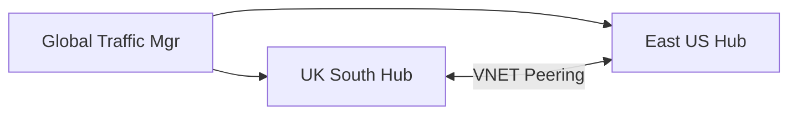

**Global Region Topology:**
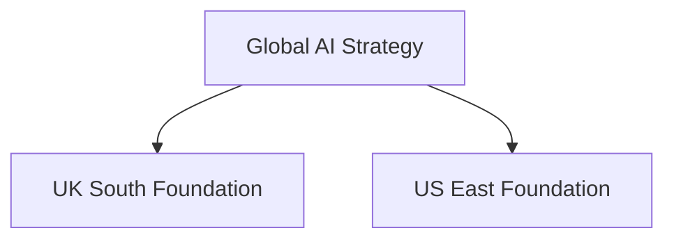

### 6. Encryption & Perimeter Protection Flow (Private Endpoint Lifecycle)
Managing the lifecycle of an AI request, automatically enforcing institutional TLS 1.3 and Private Link standards (DNS, NIC, Subnet) as required by security policy, ensuring zero-latency security confidence.

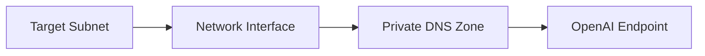

**Security Trust Boundary:**
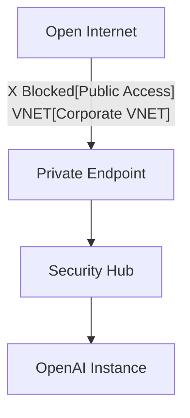

### 7. Institutional Infrastructure Maturity Scorecard (Environment Promotion)
Grading organizational performance based on key indicators: Deployment Frequency, Environment Promotion Success, and IaC Adoption Scores.

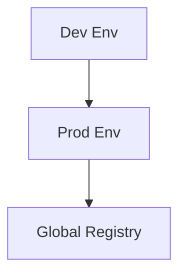

### 8. Identity & RBAC for AI Governance
Managing fine-grained access to AI hubs, provisioning workers, and audit logs between Cloud Architects, AI Engineers, and Entra ID Service Principals.

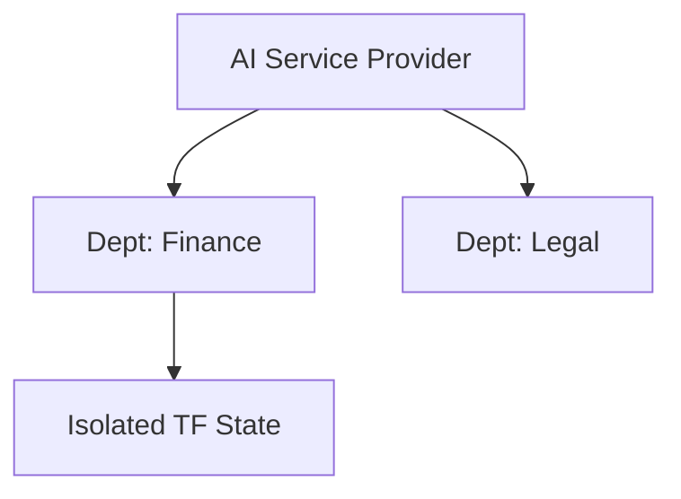

**Identity Federation Model:**
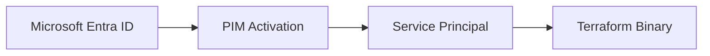

### 9. IaC Deployment: Azure-OpenAI-Terraform-as-Code Framework
Using modular CI/CD pipelines to deploy and manage the versioned distribution of the AI hubs, state backends, and validation fleets.

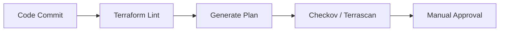

**State Backend Workflow:**
```mermaid
graph LR
    Local[Local Changes] --> Push[Push to Backend]
    Push --> Storage[Azure Blob (Locked)]
```

### 10. AIOps Drift & Risk Validation Flow
Using advanced analytics to identify sudden surges in infrastructure drift, unauthorized rule changes, or unusual delivery pattern changes that could result in institutional risk or audit failure.

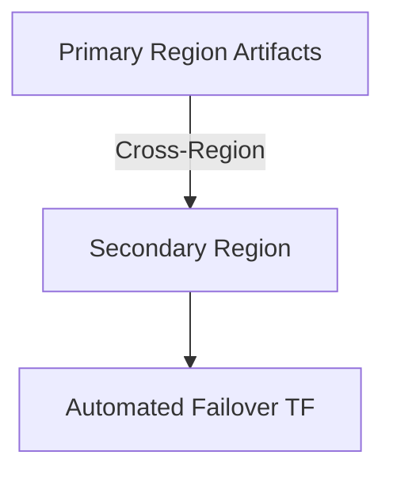

**Drift Remediation Workflow:**
```mermaid
graph LR
    Current[Actual State] != Target[Desired State]
    Target --> Fix[Terraform Refresh]
    Fix --> Update[Consolidated State]
```

**Executive Governance Workflow:**
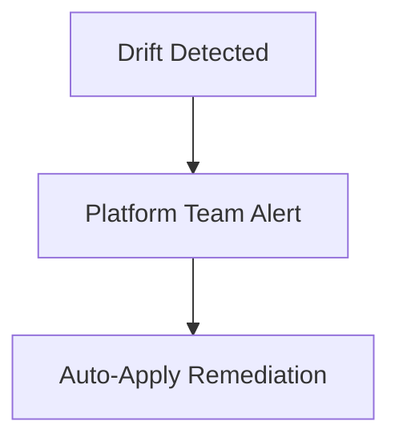

### 11. Metadata Lake for Forensic AI Audit
Storing long-term records of every infrastructure integration event (metadata), every terraform apply executed, and every monitoring telemetry for institutional record-keeping and forensic analysis.

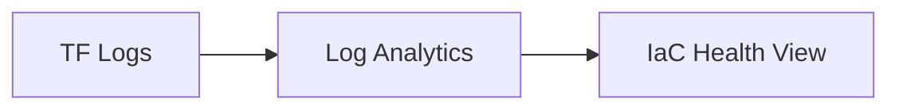

---

## 🏛️ Core Governance Pillars

1.  **Unified Foundation Coordination**: Maximizing resilience by centralizing all AI infrastructure measurement through a single institutional plane.
2.  **Automated Blueprint Provisioning**: Eliminating "manual tracking" scenarios through proactive orchestration and pattern verification.
3.  **Sequential Infrastructure Intelligence**: Ensuring zero-interruption operations through dependency-aware deployment-driven data engineering.
4.  **Zero-Trust Identity Protection**: Automatically enforcing identity-based access, private link encryption, and policy evaluation across all assurance tiers.
5.  **Autonomous Operations Logic**: Guaranteeing reliability through automated industry-specific effectiveness monitoring runbooks.
6.  **Full Infrastructure Auditability**: Immutable recording of every terraform change and infrastructure provision for institutional forensics.

---

## 🛠️ Technical Stack & Implementation

### Infrastructure Engine & APIs
*   **IaC Toolchain**: Terraform 1.5+ (HCL), AzureRM Provider.
*   **Orchestration Engine**: Custom Python-based logic (FastAPI) for multi-tenant state management and policy enforcement.
*   **Validation Suite**: Checkov, TFLint, and Terraform Compliance for security guardrails.
*   **Persistence**: Azure Blob Storage (Remote State) with Lease Locking via Table Storage.
*   **Auth Orchestrator**: Federated Microsoft Entra ID (OIDC) for least-privilege cloud management.

### Governance Dashboard (UI)
*   **Framework**: React 18 / Vite.
*   **Theme**: Dark, Slate, Indigo (Modern high-fidelity productivity aesthetic).
*   **Visualization**: D3.js for resource topologies and Recharts for cost velocity analytics.

### Infrastructure & DevOps
*   **Runtime**: GitHub Actions or Azure DevOps Pipelines for management plane.
*   **Measurement Hub**: Log Analytics Workbooks for immutable IaC timeline reconstruction.
*   **IaC**: Modular Terraform for deploying the AI landing zone and validation fleet.

---

## 🏗️ IaC Mapping (Module Structure)

| Module | Purpose | Real Services |
| :--- | :--- | :--- |
| **`modules/core`** | Foundation substrate | VNET, Subnets, KeyVault |
| **`modules/ai_services`** | GenAI Intelligence | Azure OpenAI, AI Search |
| **`modules/networking`** | Zero-Trust Perimeter | Private Endpoints, DNS Zones |
| **`modules/monitoring`** | Observability Hub | Log Analytics, App Insights |
| **`compositions/rag`** | High-level blueprints | Pre-stitched RAG environment |

---

## 🚀 Deployment Guide

### Local Principal Environment
```bash
# Clone the Azure OpenAI Terraform repository
git clone https://github.com/devopstrio/azure-openai-terraform.git
cd azure-openai-terraform

# Configure environment
cp .env.example .env

# Launch the Infrastructure stack (Development)
make init
cd terraform/environments/dev
terraform plan
terraform apply -auto-approve

# Trigger a mock infrastructure update and automated guardrail validation simulation
make simulate-deploy
```

Access the Management Portal at `http://localhost:3000`.

---

## 📜 License
Distributed under the MIT License. See `LICENSE` for more information.

---
<div align="center">
  <p>© 2026 Devopstrio. All rights reserved.</p>
</div>
